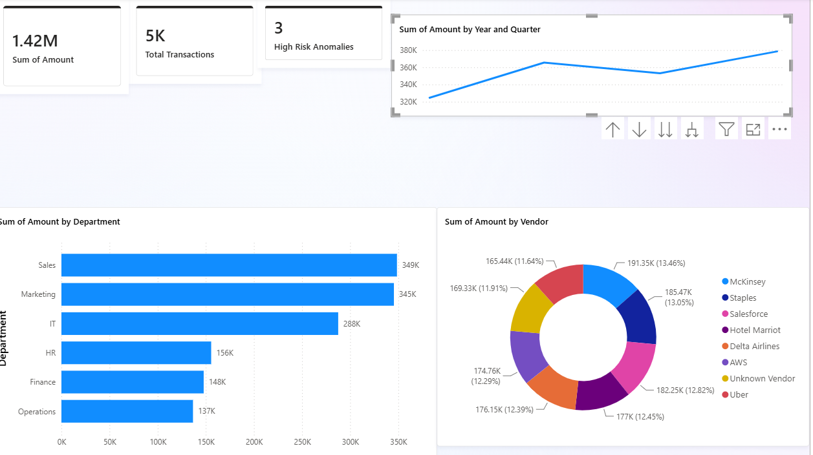

# 💸 Project 2: Financial Expenses Audit & Anomaly Detection Pipeline

An automated financial audit system designed to detect high-risk transaction anomalies, policy violations (> $10k threshold), duplicate billing patterns, and department-wise budget variances.

---

## 📸 Audit Dashboard Overview

---

## 🎯 Business Objectives & Key Metrics

* **Expense Leakage Prevention:** Flag extreme outlier claims and unauthorized vendor transactions.
* **Audit Automation:** Aggregate spend across departments to ensure budget compliance.
* **High-Risk Flags:** Identify total financial exposure from transactions exceeding policy thresholds ($10,000 limit).

---

## 🛠️ Tech Stack & Workflow

1. **Python (`expense_data_generator.py`):** Generated synthetic ledger data (5,000+ records) with injected policy violations, duplicates, and extreme expense anomalies.
2. **SQL (`financial_audit.sql`):** Created anomaly scoring models using Z-score logic, duplicate row detection, and high-value flag queries.
3. **Power BI (`Financial_Expenses_Audit.pbix`):** Built dynamic DAX risk metrics, department variance breakdown, vendor distribution, and audit KPI cards.

---

## 📊 Key Executive Metrics Summary

* **Total Spend:** $1.42 Million
* **Total Transactions Processed:** 5,025 Ledger Entries
* **High-Risk Policy Anomalies:** 3 Flagged Extreme Outliers
* **Top Spend Department:** Sales ($348K+)
